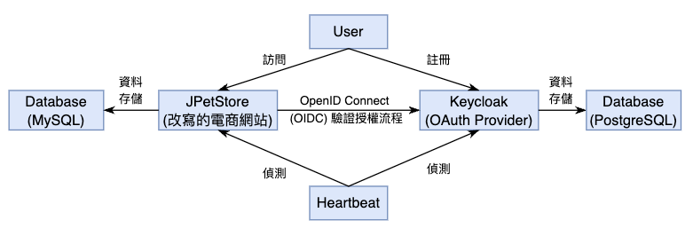

# Distributed System Final Project

## Keycloak & JPetStore OIDC Login Implementation

This repository contains the modified JPetStore application, enhanced to support OIDC login using Keycloak as the OAuth Provider. The goal is to seamlessly integrate modern authentication mechanisms into the existing application.

[](https://youtu.be/Tqi9Q-onxVo)

## System Architecture Diagram



## Getting Started

### Prerequisites

Before you start, ensure you have the following installed on your system:

-   Docker
-   Docker Compose
-   OpenSSL

### Running Keycloak Server (Auth Server)

To run the Keycloak server, follow these steps:

```bash
# Navigate to the Keycloak directory
cd keycloak

# Build the Docker images
docker-compose build

# Start the Keycloak server
docker-compose up -d
```

Once the Keycloak server is successfully started, it will be accessible via: https://localhost:8443/

You can use the default admin account to log in to the admin page. Here are the credentials:

-   **Username:** `admin`
-   **Password:** `password`

### Running JPetStore (OIDC Client)

Run with Maven Command

```bash
# Navigate to the JPetStore directory
cd jpetstore

./mvnw clean spring-boot:run
```

Run with Java command

```bash
# Build a jar file
./mvnw clean package -DskipTests=true

# Run java command
java -jar target/mybatis-spring-boot-jpetstore-2.0.0-SNAPSHOT.jar
```

Once the JPetStore server is successfully started, it will be accessible via: http://localhost:8080/

### Expected Result

After entering the JPetStore homepage, click on "Login in" in the top menu. Log in Keycloak server using the default credentials:

-   Username: `user1`
-   Password: `user1password`

You should be able to log in successfully and can use JPetStore normally.

## Possible Solution for : PKIX path building failed error

Export the SSL Certificate from Keycloak Container.

```bash
# Access the Keycloak container's bash shell
docker exec -it mykeycloak /bin/bash

# Export the SSL certificate from the Keycloak server's keystore
keytool -export -alias server -keystore /opt/keycloak/conf/server.keystore -storepass password -file /tmp/server.crt

# Locate the `server.crt` file within the Docker Desktop interface under the `tmp` directory of your container's image.
# Download this certificate file to your host machine.
```

Import the Certificate into the Java Keystore on Your Host:

```bash
"C:\Program Files\Java\jdk-17\bin\keytool.exe" -importcert -file "[path\to\server.crt]" -alias "keycloak-server" -keystore "C:\Program Files\Java\jdk-17\lib\security\cacerts" -storepass changeit
```

**NOTICE:** The path to keytool.exe provided above is based on a typical installation of JDK 17 on Windows. If you have a different version of Java installed, or if Java is installed in a different location, you will need to adjust the path accordingly.

## Heartbeat

Because the server.crt applied in the previous step is needed when checking https, you need to install OpenSSL first.

```bash
#convert server.crt into server.pem
openssl x509 -in server.crt -out server.pem -outform PEM

#then you have to change the cert_path in hertbeat.py to your server.pem path.
```

You have to change sender_email, sender_password, receiver_email of send_alert in heartbeat.py to your information.

**NOTICE:**sender_password must be sender's email's app passwords, not the usual one.

Then you can run heartbeat.py by

```bash
python heartbeat.py
```

## Demo and Presentation

-   OIDC Login: https://youtu.be/Tqi9Q-onxVo
-   Heartbeat: https://youtu.be/Y9gj3t7iIQE
-   Slides: https://drive.google.com/file/d/1KOzecuXiYpNenW0NyVHxaCGiMggL3IRx/view?usp=sharing
