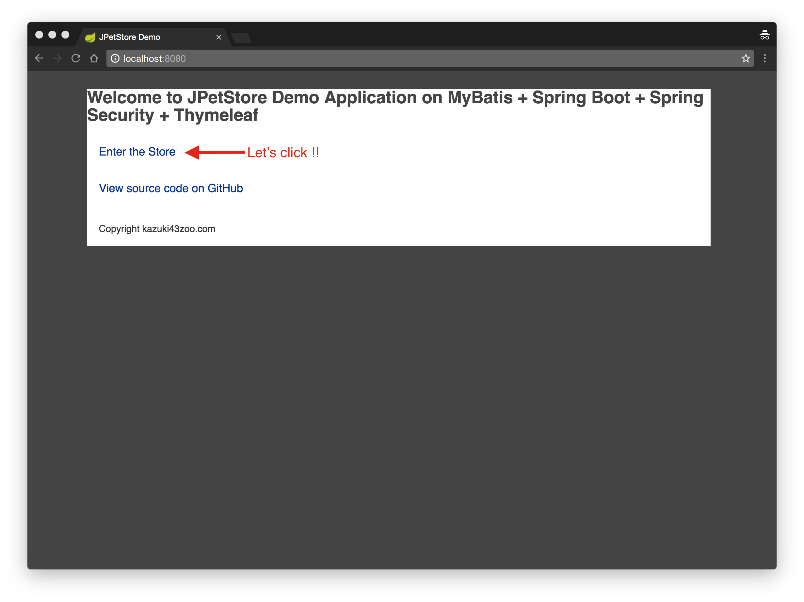
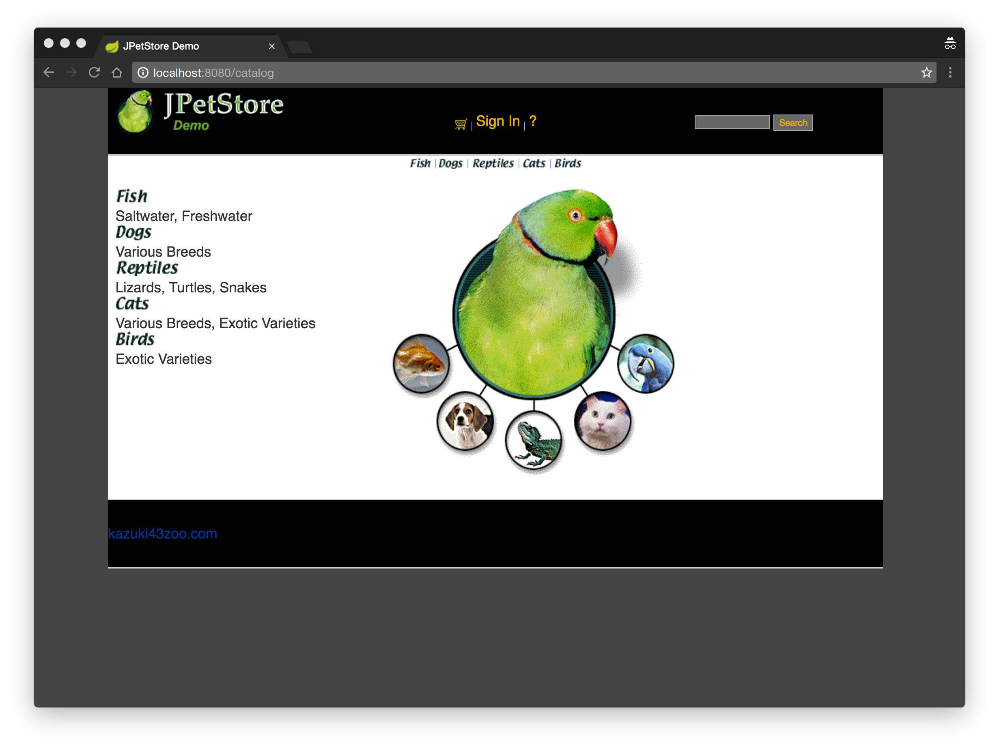

<<<<<<< HEAD
# Distributed System Final Project
## Keycloak OIDC Login Implementation

### Prerequisites
Before you start, ensure you have the following installed on your system:
- Docker
- Docker Compose

### Running Keycloak Server (Auth Server)
To run the Keycloak server, follow these steps:

```bash
# Navigate to the Keycloak directory 
cd keycloak

# Build the Docker images
docker-compose build

# Start the Keycloak server
docker-compose up -d
```

Once the Keycloak server is successfully started, it will be accessible via: https://localhost:8443/

You can use the default admin account to log in to the admin page. Here are the credentials:
- **Username:** `admin`
- **Password:** `password`

### Running JPetStore (OIDC Client)
Run with Maven Command
```bash
# Navigate to the JPetStore directory 
cd jpetstore

./mvnw clean spring-boot:run
```
Run with Java command
```bash
# Build a jar file
./mvnw clean package -DskipTests=true

# Run java command
java -jar target/mybatis-spring-boot-jpetstore-2.0.0-SNAPSHOT.jar
```

Once the JPetStore server is successfully started, it will be accessible via: http://localhost:8080/

### Expected Result

After entering the JPetStore homepage, click on "Login in" in the top menu. Log in Keycloak server using the default credentials:

- Username: `user1`
- Password: `user1password`

You should be able to log in successfully and can use JPetStore normally.

### Possible Solution for : PKIX path building failed error
Export the SSL Certificate from Keycloak Container.
    
  ```bash
  # Access the Keycloak container's bash shell
  docker exec -it mykeycloak /bin/bash
  
  # Export the SSL certificate from the Keycloak server's keystore    
  keytool -export -alias server -keystore /opt/keycloak/conf/server.keystore -storepass password -file /tmp/server.crt
  
  # Locate the `server.crt` file within the Docker Desktop interface under the `tmp` directory of your container's image. 
  # Download this certificate file to your host machine.
   ```

Import the Certificate into the Java Keystore on Your Host:

  ```bash
  "C:\Program Files\Java\jdk-17\bin\keytool.exe" -importcert -file "[path\to\server.crt]" -alias "keycloak-server" -keystore "C:\Program Files\Java\jdk-17\lib\security\cacerts" -storepass changeit
  ```
**NOTICE:** The path to keytool.exe provided above is based on a typical installation of JDK 17 on Windows. If you have a different version of Java installed, or if Java is installed in a different location, you will need to adjust the path accordingly.
### Reference
- OIDC Login flow: https://docs.google.com/presentation/d/1CiAiuay5rd1KDDnYwOyu6ud9xk5ZetSQDOMp9DYUKjs/edit?pli=1#slide=id.g8bb7b0e120_0_0

# JpetstoreHealthIndicator

The `JpetstoreHealthIndicator` is a custom health indicator for a Spring Boot application. It checks the health of an external service (running on `http://localhost:8080`) and provides the status through the Actuator health endpoint.

## Features

- Checks the status of an external service.
- Provides detailed health status information.
- Uses `HttpClient` to send HTTP requests and handle responses.
- Configures connection timeout for the HTTP client.

## Run the Application

Start your Spring Boot application. The custom health indicator will automatically be picked up by the Spring Boot Actuator.

## Access the Health Endpoint

After successfully running the Jpetstore application, you can check the health status by navigating to [http://localhost:8080/actuator/health](http://localhost:8080/actuator/health) in your web browser.

Alternatively, you can retrieve the health status by making a GET request to the `/actuator/health` endpoint using `curl`:

```bash
curl 'http://localhost:8080/actuator/health' -i -X GET -H 'Accept: application/json'

=======
# mybatis-spring-boot-jpetstore

[](https://github.com/kazuki43zoo/mybatis-spring-boot-jpetstore/actions/workflows/ci.yaml)
[](https://github.com/kazuki43zoo/mybatis-spring-boot-jpetstore/actions/workflows/dependency-check.yaml)
[](https://sonarcloud.io/summary/new_code?id=kazuki43zoo_mybatis-spring-boot-jpetstore)
[](https://sonarcloud.io/summary/new_code?id=kazuki43zoo_mybatis-spring-boot-jpetstore)

This sample is a web application built on MyBatis, Spring Boot(Spring MVC, Spring Security) and Thymeleaf.
This is another implementation of MyBatis JPetStore sample application (https://github.com/mybatis/jpetstore-6).

Original application is available for downloading in the downloads section of MyBatis project site.
In this section, we will walk through this sample to understand how is it built and learn how to run it.

> **Note**
>
> This sample application is under development.
> If you found an issue, please report from [here](https://github.com/kazuki43zoo/mybatis-spring-boot-jpetstore/issues/new).

## Requirements

* Java 8+ (JDK 1.8+)

## Stacks

* MyBatis Spring Boot Starter 2.2 (MyBatis 3.5, MyBatis Spring 2.0)
* Spring Boot 2.7 (Spring Framework 5.3, Spring Security 5.7)
* Thymeleaf 3.0
* Hibernate Validator 6.2 (Bean Validation 2.0)
* HSQLDB 2.5 (Embed Database)
* Flyway 8.5 (DB Migration)
* Tomcat 9.0 (Embed Application Server)
* Groovy 4.0 (Use multiple line string on MyBatis Mapper method)
* Lombok 1.18
* Selenide 6.5
* Selenium 4.1
* etc ...

## Run using Maven command

* Clone this repository

  ```
  $ git clone https://github.com/kazuki43zoo/mybatis-spring-boot-jpetstore.git
  ```
  
* Run a web application using the spring-boot-plugin

  ```
  $ cd mybatis-spring-boot-jpetstore.git
  $ ./mvnw clean spring-boot:run
  ```

## Run using java command

* Build a jar file

  ```
  $ ./mvnw clean package -DskipTests=true
  ```

* Run java command

  ```
  $ java -jar target/mybatis-spring-boot-jpetstore-2.0.0-SNAPSHOT.jar
  ```

## Perform integration test using Maven command

Perform integration tests for screen transition.

```
$ ./mvnw clean test
```


## Run on IDEs (Note)

This sample use the [Lombok](https://projectlombok.org/) to generate setter method, getter method and constructor.
If this sample application run on your IDE, please install the Lombok. (see [https://projectlombok.org/download.html](https://projectlombok.org/download.html))

And this application use the groovy language to use multiple line string on MyBatis Mapper method.
If this sample application run on your IDE, please convert to groovy project and add `src/main/groovy` into source path.
And if you use a STS(or Eclipse), please install the Groovy Eclipse plugin. About how install the Groovy Eclipse, please see as follow:

* https://github.com/groovy/groovy-eclipse/wiki


e.g.) multiple line string on MyBatis Mapper method

```groovy
@Mapper
@CacheNamespace
interface CategoryMapper {

    @Select('''
        SELECT
            CATID AS categoryId,
            NAME,
            DESCN AS description
        FROM
            CATEGORY
        WHERE
            CATID = #{categoryId}
    ''')
    Category getCategory(String categoryId)

}
```

## Access to the index page

[http://localhost:8080/](http://localhost:8080/)






## Default active accounts (ID/PASSWORD)

* j2ee/j2ee
* ACID/ACID

## Data Store

In this application, application data stored in filesystem files.

```
$HOME
  └── db
      + jpetstore.script
      + jpetstore.properties
```

## Project Structure

Project structure of this sample application is as follow:

```
.
└── src
    └── main
        ├── groovy
        │   └── com
        │       └── kazuki43zoo
        │           └── jpetstore
        │               └── mapper         // Store mapper interfaces
        ├── java
        │   └── com
        │       └── kazuki43zoo
        │           └── jpetstore
        │               ├── component      // Store general component classes
        │               │   ├── event
        │               │   ├── exception
        │               │   ├── message
        │               │   └── validation
        │               ├── config         // Store configuration classes
        │               ├── domain         // Store domain objects
        │               ├── service        // Store service classes
        │               └── ui             // Store classes that depends user interface
        │                   └── controller // Store controller classes
        └── resources
            ├── db                         // Store sql files for Flyway
            │   └── migration
            ├── static                     // Store static web resource files
            │   ├── css
            │   └── images
            └── templates                  // Store view template files for Thymeleaf
                ├── account
                ├── auth
                ├── cart
                ├── catalog
                ├── error
                └── order
```
>>>>>>> 7a097ed711dbb948b99e441a4ab0981f024f6e27
